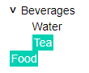

# TreeViewWidget.jl
A minimal TreeView widget for use in Jupyter notebooks (and maybe Blink)

## Installation

```
    julia>]add TreeViewWidget
```

## Example

Create a treeview widget from a treeview structure:
```
    tree = TreeViewRoot()
    beverages = TreeViewNode("Beverages")
    push!(beverages, TreeViewNode("Water"))
    push!(beverages, TreeViewNode("Tea"))
    push!(tree, beverages)
    push!(tree, TreeViewNode("Food"))

    treeview = TreeView(tree)
```

The elements with children are shown as collapsed nested structures. You can expand them by clicking on the `>` icon.
The text of each element can be selected. Use CTRL+Click to select multiple elements.



The selection is available in Julia via an Observable. This is an array of dictionaries with the text label `treeview[][1]["label"]` and the identifier `treeview[][1]["id"]` which is also present in each `TreeViewNode`, in case you have non-unique labels.
```
    julia> treeview[]
2-element Array{Dict{String,String},1}:
 Dict("label" => "Tea","id" => "654c1dbc-a4c4-42ec-9290-b27ce6165993")
 Dict("label" => "Food","id" => "8c26fdf9-9d4b-4f04-ae54-0f94ad21603c")
```